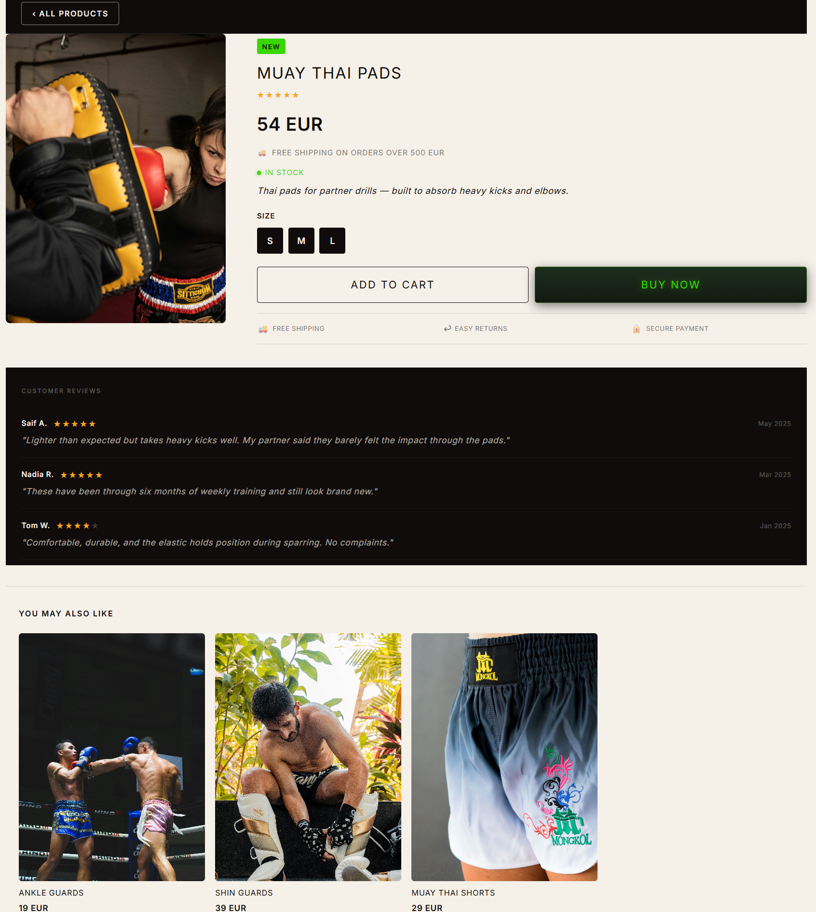
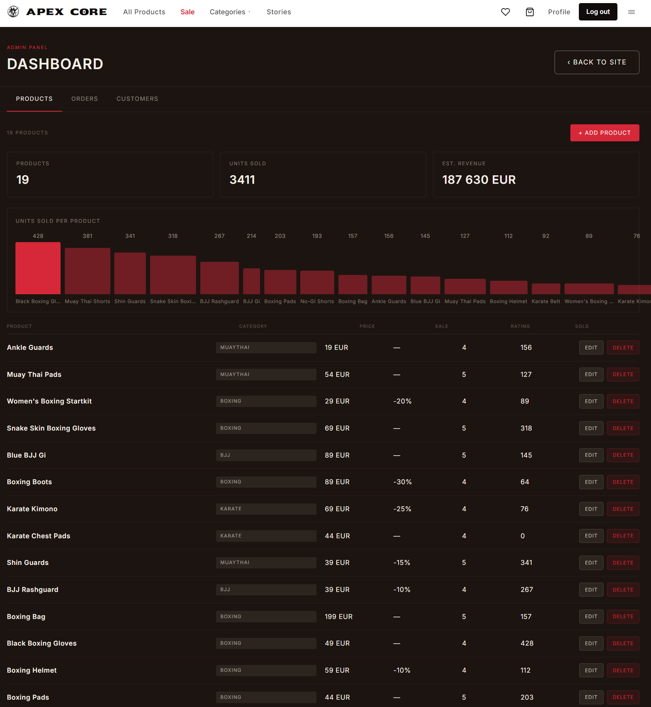

# Apex Core — Martial Arts Store

Apex Core is a fullstack web shop for martial arts equipment. Visitors can browse products, read articles about different martial arts, add products to the cart, and save favorites. Logged-in users can complete purchases and view their order history via My Pages. The application supports both guest and authenticated modes, with data persisted in MongoDB.

## Stack

- **Client** — React + Vite + Custom CSS
- **Server** — Node.js + Express + MongoDB (Atlas)

---

## Screenshots

### Store Front


### Product Page



### Admin Dashboard



---

## Project Structure

```
martial-store-fullstack/
├── client/                     # React client
│   └── src/
│       ├── components/         # Reusable components (Navbar, Hero, cart, products, favorites)
│       ├── context/            # Global state: AuthContext, CartContext, FavoriteContext
│       ├── data/               # Static data (articles)
│       ├── hooks/              # Custom hooks (useFetch, useInput)
│       ├── layouts/            # Page layouts (MainLayout, MinimalLayout)
│       ├── pages/              # Pages (HomePage, ProductsPage, CartPage, auth pages, etc.)
│       └── services/           # API calls to backend (auth, cart, orders, products, favorites)
└── server/                     # Express backend
    ├── config/                 # Database connection (MongoDB)
    ├── controllers/            # Request handlers per resource
    ├── middleware/             # JWT validation and global error handling
    ├── models/                 # Mongoose models (User, Product, Order, etc.)
    ├── repositories/           # Database queries (data layer)
    ├── routes/                 # Express routes per resource
    ├── services/               # Business logic
    └── seeder.js               # Script to populate the database with test data
```

---

## Getting Started

### Prerequisites

- Node.js v18+
- MongoDB Atlas account (or local MongoDB)

### 1. Clone the repository

```bash
git clone https://github.com/roerstrand/martial-store-fullstack.git
cd martial-store-fullstack
```

### 2. Environment variables

Create the file `server/.env` with the following content:

```env
PORT=3000
CLIENT_URL=http://localhost:5173
MONGO_URI=<your MongoDB Atlas connection string>
ACCESS_TOKEN_SECRET=<any secret key>
```

### 3. Install dependencies

```bash
# Root folder (installs concurrently)
npm install

# Server
cd server && npm install

# Client
cd ../client && npm install
```

### 4. Seed the database

```bash
cd server
node seeder.js
```

Creates accounts and populates all products and articles:

> **NOTE:** Login is done with a **username** (name), not email.

| Username | Password     |
|----------|--------------|
| Admin    | admin1234    |
| Customer | customer1234 |
| user     | password     |

### 5. Start the application

From the **root folder**:

```bash
npm run dev
```

Starts client and server simultaneously via `concurrently`.

| Service | URL                     |
|---------|-------------------------|
| Client  | http://localhost:5173   |
| Server  | http://localhost:3000   |

---

## Backend

The server is built with Node.js and Express, using MongoDB as the database via Mongoose. The architecture follows a 4-layer pattern: routes → controllers → services → repositories.

**API endpoints:**

| Method | Endpoint | Access | Description |
|--------|----------|--------|-------------|
| POST | `/api/users/register` | Public | Register account |
| POST | `/api/users/login` | Public | Log in, returns JWT |
| GET | `/api/users/current` | Private | Get logged-in user |
| GET | `/api/users` | Admin | List all users |
| GET | `/api/products` | Public | List products (supports `?newArrival=true`, `?limitedSale=true`) |
| GET | `/api/products/:id` | Public | Get single product |
| POST | `/api/products` | Admin | Create product |
| PUT | `/api/products/:id` | Admin | Update product |
| DELETE | `/api/products/:id` | Admin | Delete product |
| GET | `/api/products/myProducts` | Private | Get products created by logged-in user |
| GET | `/api/orders` | Admin | List all orders |
| GET | `/api/orders/me` | Private | Get own orders |
| POST | `/api/orders` | Private | Create order (checkout) |
| GET | `/api/orders/:id` | Private | Get single order |
| PATCH | `/api/orders/:id/status` | Admin | Update order status |
| DELETE | `/api/orders/:id` | Admin | Delete order |
| GET | `/api/carts` | Admin | List all carts |
| GET | `/api/carts/me` | Private | Get logged-in user's cart |
| POST | `/api/carts` | Private | Create cart |
| GET | `/api/carts/:id` | Private | Get cart by ID |
| PUT | `/api/carts/:id` | Private | Update cart |
| POST | `/api/carts/:id/products` | Private | Add product to cart |
| DELETE | `/api/carts/:id/products/:productId` | Private | Remove product from cart |
| PATCH | `/api/carts/:id/products/:productId/increase` | Private | Increase quantity |
| PATCH | `/api/carts/:id/products/:productId/decrease` | Private | Decrease quantity |
| DELETE | `/api/carts/:id/reset` | Private | Clear cart |
| GET | `/api/favorites/me` | Private | Get favorites |
| POST | `/api/favorites` | Private | Create favorites list |
| POST | `/api/favorites/products/:productId` | Private | Add favorite |
| DELETE | `/api/favorites/products/:productId` | Private | Remove favorite |
| GET | `/api/articles` | Public | List articles |
| GET | `/api/articles/:id` | Public | Get single article |

**Authentication:** JWT (Bearer token). Private routes require a valid token in the `Authorization` header. Token expires after 24 hours.

**Validation:** All endpoints validate required fields and return correct HTTP status codes — `200`, `201`, `400`, `404`, `500` — via a global `errorMiddleware`.

---

## Project Analysis

### Project Structure and Architecture

The project structure consists of a React client and a Node/Express backend. The backend has a 4-layer data flow with repositories, services, controllers, and routes for products, users, cart, orders, favorites, and articles (designed to generate interest in sports/products). The backend includes a global error handler (errorMiddleware) and token validation used in routes, for both general authentication and admin validation through RBAC (set in the model).

Pre-work on UX and UI in Figma (linked below along with exported files) greatly improved the product for the end user.

### Technical Design Decisions

On the frontend, global state for the logged-in user is handled through a custom React context — `AuthContext` — which wraps the entire app. AuthContext with added values from the provider is imported via the custom hook `useAuth` wherever needed. The importing component/file thereby gains access to the global AuthContext (found in `main.jsx`). Two additional contexts exist for favorite products and the cart. The contexts handle both guest users via localStorage and logged-in users whose data is stored in the backend.

JWT was chosen as the authentication method, and the token is stored in localStorage and managed by `validateTokenHandler` on the client side. There is also an adminValidator to access the admin dashboard and to create products, retrieve all carts, etc. Admin permissions are essential in a finished product sold to customers so they can manage their business (and can be expanded significantly further).

An error boundary was also implemented to catch rendering errors on the client side, in addition to the global error handler in the backend.

### Challenges and Lessons Learned

The Node/Express ecosystem takes a more "production ready first" approach compared to .NET, which focuses more on scalability from the start. This was both a lesson and a challenge throughout the project — starting by creating endpoints in controllers and testing them, then gradually moving logic into services and repositories. This felt more flexible compared to .NET where logic can be tested at an earlier stage, but it could also feel like extra work when moving logic that could have been placed in services/repos from the beginning.

Another lesson learned is that a React project can grow very large very quickly and requires clear structure and organization to work efficiently against the backend and its respective endpoints. Naming conventions became very important as the project grew — a clear "Page" postfix for actual pages and categorization of JSX files (cart, products, auth, etc.).

Custom hooks and custom contexts (which also use each other) saved a lot of time, effort, and logic in components.
